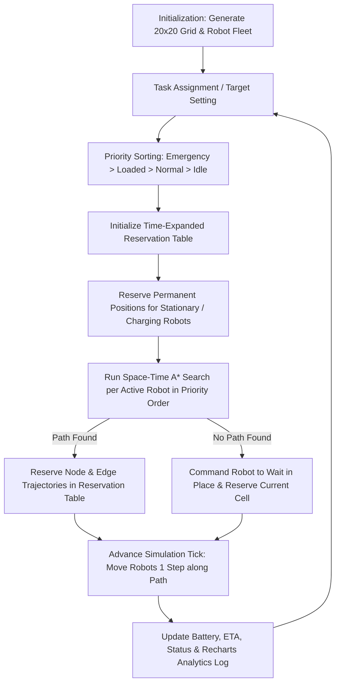
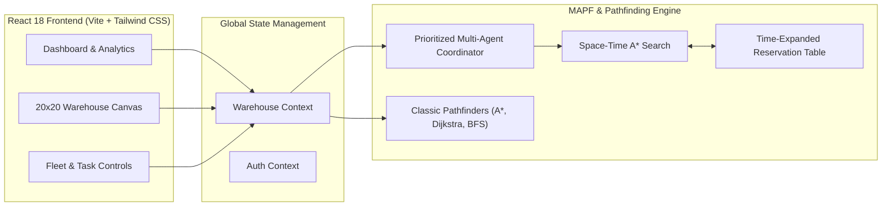

# 🤖 Robot Warehouse Path Finder

A multi-agent warehouse robot path planning and collision avoidance system for intelligent autonomous navigation.


---

### 🚀 Live Demo

Experience the live interactive simulation:
👉 **[https://robot-wherehouse-path-finder.vercel.app/](https://robot-wherehouse-path-finder.vercel.app/)**

---

## 📌 Overview

**Robot Warehouse Path Finder** is an interactive, web-based simulation engine designed to model and visualize autonomous mobile robots (AMRs) and automated guided vehicles (AGVs) navigating a 20×20 grid-based fulfillment warehouse.

In modern automated distribution centers, dozens of autonomous robots move concurrently to pick up, transfer, and deliver inventory items. The primary engineering challenge is **Multi-Agent Path Finding (MAPF)**: enabling multiple robots to compute optimal paths to their destinations while dynamically resolving traffic bottlenecks, avoiding same-cell and head-on collisions, and preventing spatial deadlocks.

This system combines single-agent shortest path algorithms (**A\***, **Dijkstra**, **BFS**) with a prioritized **Space-Time A\*** planner backed by a **Time-Expanded Reservation Table**. Higher-priority robots (e.g., Emergency or Loaded vehicles) claim space-time cells first, while lower-priority robots dynamically wait or reroute around reserved space-time trajectories.

---

## ✨ Features

- **Multi-Agent Robot Simulation**: Concurrent tracking and path execution for up to 20 warehouse robots (AGVs, AMRs, Forklifts, and Swift Runners).
- **20×20 Interactive Warehouse Grid**: Visualizes storage shelves (Blocks A–F), charging stations, packing areas, delivery zones, and structural pillars.
- **Space-Time A\* Pathfinding**: Computes optimal trajectories in discrete $(x, y, t)$ space using Manhattan distance heuristics.
- **Time-Expanded Reservation Table**: Tracks vertex and edge reservations over time to guarantee collision-free coordination.
- **Dynamic Collision Avoidance**: Resolves same-node conflicts, head-on position swaps, and cross-path deadlocks in real time.
- **Priority-Based Coordination**: Prioritizes fleet movement across four tier levels: `Emergency` > `Loaded` > `Normal` > `Idle`.
- **Dynamic Yielding & Replanning**: Automatically commands lower-priority robots to wait in place or recalculate paths when higher-priority robots reserve conflicting routes.
- **Real-Time Fleet & Task Monitoring**: Live tracking of robot positions, operational status (`Moving`, `Idle`, `Charging`, `Waiting`, `Completed`), target destinations, battery levels, speed, and payload weights.
- **Interactive Map Editing**: Allows users to set custom targets, toggle extra obstacles, and select specific robots directly on the grid.
- **Algorithm Benchmarking Modal**: Side-by-side performance comparison of **A\***, **Dijkstra**, and **BFS** measuring execution time (ms), nodes visited, path length, and memory consumption.
- **Recharts Performance Analytics**: Real-time analytical dashboard visualizing execution latency, node visits, collision avoidance frequency, robot utilization, and memory usage.
- **Simulation Control Panel**: Play, pause, step forward, adjust simulation speed (0.5× to 5×), adjust grid zoom, and set global pathfinding algorithms.

---

## 🧠 How It Works

The simulation lifecycle executes through a continuous coordination loop managed by the central warehouse context:



### System Workflow Steps:
1. **Environment Initialization**: A 20×20 grid is constructed with defined shelf blocks, charging docks, packing bays, drop-off delivery zones, and fixed structural pillars.
2. **Fleet Initialization**: Robots spawn at defined positions with designated models (AGV-100X, FL-500, OR-50, SR-20), battery levels, and initial targets.
3. **Priority Sorting**: Active robots with assigned destinations are ordered based on priority weight: `Emergency` (4), `Loaded` (3), `Normal` (2), and `Idle` (1).
4. **Reservation & Path Calculation**: High-priority robots run Space-Time A\* search first and reserve their required $(x, y, t)$ coordinates and transition edges in the `ReservationTable`.
5. **Conflict Resolution & Replanning**: Lower-priority robots plan their paths against the populated reservation table. If a space-time cell is occupied, the planner evaluates alternative routes or inserts wait states.
6. **Real-Time Step Execution**: As the simulation clock advances, robots move step-by-step along their reserved paths, updating battery levels, activity logs, and system metrics.

---

## 🗺️ Path Planning

The project implements both classic single-agent search algorithms for benchmarking and a space-time extension for multi-robot navigation.

### Single-Agent Pathfinding Algorithms
- **A\* Search**: Guided search utilizing Manhattan distance heuristics to find optimal paths while minimizing expanded nodes.
- **Dijkstra's Algorithm**: Uniform-cost search exploring nodes in order of cumulative distance $g(n)$.
- **Breadth-First Search (BFS)**: Unweighted grid traversal exploring uniform graph depth.

### A\* Heuristic & Evaluation Function
For a grid node $n = (x, y)$ and target goal $g = (x_{\text{goal}}, y_{\text{goal}})$, the evaluation function is:

$$f(n) = g(n) + h(n)$$

Where:
- $g(n)$ is the exact movement cost from the start position to node $n$.
- $h(n)$ is the **Manhattan Distance** heuristic estimating the cost from node $n$ to the goal:

$$h(n) = |x - x_{\text{goal}}| + |y - y_{\text{goal}}|$$

- $f(n)$ represents the estimated total path cost through node $n$.

---

## 🤖 Multi-Agent Coordination

Multi-robot fleet movement is coordinated using **Prioritized Space-Time A\*** search paired with a **Time-Expanded Reservation Table**.

```
Time-Expanded Reservation Table Structure:
----------------------------------------------------------------------
Node Reservation Key : "x,y,t"                -> robotId
Edge Reservation Key : "x2,y2 -> x1,y1,t"     -> robotId  (Edge Swap)
Permanent Key        : "x,y"                  -> { robotId, fromTime }
----------------------------------------------------------------------
```

### Coordination Logic
1. **Priority Hierarchy**: Higher priority robots plan first and reserve space-time cells.
   - `Emergency` (Weight: 4)
   - `Loaded` (Weight: 3)
   - `Normal` (Weight: 2)
   - `Idle` (Weight: 1)
2. **Path Reservation**: Once a path is calculated for robot $R_i$, every node $(x, y)$ at step $t$ is registered in `ReservationTable`.
3. **Target Destination Locking**: Upon reaching its target (or if stationary), a robot permanently reserves its location to prevent other robots from routing through its stopping point.

---

## 🚧 Collision Avoidance

The system explicitly prevents three major multi-robot collision scenarios:

1. **Same-Node Collisions**: Prevents two robots from occupying the exact same coordinate $(x, y)$ at the same time step $t$.
2. **Head-On / Edge-Swap Collisions**: Prevents Robot $A$ moving from $(x_1, y_1) \to (x_2, y_2)$ at time $t$ while Robot $B$ simultaneously moves from $(x_2, y_2) \to (x_1, y_1)$ at time $t$.
3. **Deadlock & Blockage Mitigation**: If a path is blocked by higher-priority reservations, the algorithm generates a "Wait-in-place" action $(x, y, t+1)$, allowing lower-priority robots to yield safely until the path clears.

---

## 🖥️ Dashboard & Views

The application provides specialized user interface views:

- **Dashboard**: Central command hub featuring fleet status counts, warehouse map preview, active activity logs, system throughput stats, and simulation quick controls.
- **Warehouse Map**: High-resolution 20×20 grid canvas displaying shelf units, charging docks, delivery bays, dynamic robot markers, path lines, and interactive cell inspection.
- **Robot Fleet Management**: Detailed table listing all 20 robots, supporting priority adjustments (`Emergency`, `Loaded`, `Normal`, `Idle`), battery status filters, manual target selection, and task details.
- **Task Scheduler**: Interface for creating, scheduling, and assigning picking/delivery tasks to available fleet vehicles.
- **Orders Management**: Order tracking module monitoring incoming inventory orders, assigned robots, picking locations, and fulfillment status.
- **Analytics Hub**: Recharts-powered dashboard tracking pathfinding execution times, visited node counts, collision avoidance events, memory usage, and fleet utilization.
- **Simulation Viewer**: Interactive sandbox providing playback controls (Play, Pause, Step Forward, Speed 0.5×–5×) and algorithm comparison benchmarks.
- **Settings**: Configuration panel for warehouse settings, refresh rates, default algorithm selection, and obstacle density.

---

## 🏗️ System Architecture



---

## 🛠️ Tech Stack

| Category | Technology | Purpose |
|---|---|---|
| **Frontend Framework** | React 18.3.1 | Modular UI component architecture |
| **Build Tooling** | Vite 5.4.1 | Lightning-fast HMR dev server and production bundler |
| **Language** | JavaScript (ES6+) | Application logic and pathfinding algorithms |
| **UI Styling** | Tailwind CSS 3.4.10 | Utility-first responsive dark mode design system |
| **Icons & Motion** | Lucide React & Framer Motion | Modern UI icons and smooth interface animations |
| **Data Visualization** | Recharts 2.12.7 | Real-time performance analytics charts |
| **Routing** | React Router DOM 6.26.1 | Single-Page Application (SPA) client-side routing |
| **Containerization** | Docker (Multi-stage) | Production build isolation (`node:20-alpine` + `nginx:alpine`) |
| **Web Server** | Nginx | Production static web server with SPA fallback routing |
| **Deployment** | Vercel | Cloud hosting platform for live application demo |

---

## 📂 Project Structure

```
Robot_wherehouse_path/
├── Dockerfile              # Multi-stage Docker build configuration
├── docker-compose.yml      # Docker compose service definition (port 3000:80)
├── nginx.conf              # Nginx production configuration with SPA fallback
├── .dockerignore           # Excluded build artifacts for Docker context
├── package.json            # Node.js dependencies and build scripts
├── vite.config.js          # Vite configuration settings
├── index.html              # HTML entry point
├── src/
│   ├── main.jsx            # Application root renderer
│   ├── App.jsx             # Main routing and layout configuration
│   ├── index.css           # Global Tailwind CSS styles
│   ├── components/         # Reusable UI components
│   │   ├── common/         # Navbar, Sidebar, Modals, Cards
│   │   ├── simulation/     # Benchmark modal, Controls panel, Path legend
│   │   └── warehouse/      # Warehouse grid canvas, Robot markers, Cell tooltips
│   ├── context/            # React Context State Providers
│   │   ├── AuthContext.jsx       # Demo authentication state
│   │   └── WarehouseContext.jsx  # Global warehouse state & simulation loop
│   ├── pages/              # SPA Page Views
│   │   ├── DashboardPage.jsx     # Fleet overview & system metrics
│   │   ├── WarehouseMapPage.jsx  # Interactive grid editor & viewer
│   │   ├── RobotsPage.jsx        # Fleet management & priority editor
│   │   ├── TaskSchedulerPage.jsx # Dispatch & task assignment
│   │   ├── OrdersPage.jsx        # Order fulfillment tracking
│   │   ├── AnalyticsPage.jsx     # Recharts analytical charts
│   │   ├── SimulationPage.jsx    # Real-time simulation playback
│   │   ├── SettingsPage.jsx      # System configuration panel
│   │   └── LoginPage.jsx         # Demo login screen
│   └── utils/              # Algorithms & Data Models
│       ├── mockData.js     # 20x20 warehouse layout, 20 robots, sample orders
│       └── pathfinding.js  # Space-Time A*, Reservation Table, A*, Dijkstra, BFS
└── README.md               # Project documentation
```

---

## ⚙️ Installation & Setup

### Prerequisites
- **Node.js**: `v18.0.0` or higher
- **npm**: `v9.0.0` or higher
- **Docker** *(optional, for containerized execution)*

---

### Local Development

1. **Clone the Repository**:
   ```bash
   git clone https://github.com/AI-btech-project/Robot_wherehouse_path.git
   cd Robot_wherehouse_path
   ```

2. **Install Dependencies**:
   ```bash
   npm install
   ```

3. **Start the Development Server**:
   ```bash
   npm run dev
   ```

4. **Access the Application**:
   Open your browser and navigate to:
   `http://localhost:3000`

---

### 🐳 Run with Docker

This project includes a production-ready, multi-stage `Dockerfile` and `docker-compose.yml`.

#### Using Docker Compose (Recommended):

1. **Build and start the container**:
   ```bash
   docker compose build
   docker compose up
   ```

2. **Access the Application**:
   Open [http://localhost:3000](http://localhost:3000)

3. **Stop the container**:
   ```bash
   docker compose down
   ```

#### Using Standard Docker CLI:

```bash
# Build Docker Image
docker build -t robot-warehouse-path-finder .

# Run Container
docker run -p 3000:80 robot-warehouse-path-finder
```

---

### 🏭 Production Build

To create a minified production bundle locally:

```bash
npm run build
```

The output will be generated in the `dist/` directory, ready to be served by Nginx or any static file host.

---

### ☁️ Deployment

The application is deployed on **Vercel**:
👉 **[https://robot-wherehouse-path-finder.vercel.app/](https://robot-wherehouse-path-finder.vercel.app/)**

---

## 🎯 Use Cases

- **Automated Fulfillment Centers**: Simulating AGV/AMR fleet routing in e-commerce fulfillment hubs (e.g., Amazon Kiva-style warehouses).
- **Smart Factory Logistics**: Optimizing material transport between manufacturing assembly lines and storage bays.
- **Multi-Agent Robotics Research**: Benchmarking MAPF algorithms (Space-Time A\*, CBS, Conflict-Based Search) in grid topologies.
- **Traffic Bottleneck Analysis**: Evaluating warehouse layout efficiency, pillar placement impact, and corridor throughput under heavy fleet density.

---

## 🔬 Technical Highlights

- **Space-Time Graph Representation**: Models movement in $(x, y, t)$ coordinates to resolve time-dependent path collisions.
- **Time-Expanded Reservation Table**: Efficient spatial hashing via Javascript `Map` data structures for $O(1)$ node and edge reservation checks.
- **Priority-Weighted Fleet Scheduling**: Prevents starvation by dynamically allocating right-of-way based on mission urgency (`Emergency` > `Loaded` > `Normal` > `Idle`).
- **Zero Heavy External Dependencies**: Pathfinding and collision avoidance engines are engineered natively in vanilla JavaScript without heavy third-party graph libraries.
- **Production Containerization**: Multi-stage Docker build producing lightweight Nginx containers (<25MB image footprint).

---

## 🚀 Future Enhancements

- **Conflict-Based Search (CBS) & ECBS**: Implementing optimal MAPF solvers for larger fleets (>100 robots).
- **Continuous Time & Kinetic Motion**: Modeling smooth acceleration, turning radius constraints, and non-holonomic kinematics.
- **Dynamic Obstacle Sensing**: Real-time obstacle detection simulating onboard LiDAR/Ultrasonic sensors.
- **3D Warehouse Canvas**: Upgrading the grid renderer to a WebGL/Three.js 3D isometric view.
- **Hardware Integration**: ROS 2 (Robot Operating System) bridge for real-world AMR telemetry and command execution.

---

## 👨‍💻 Contributors

Developed by the **AI-btech-project** engineering team as an advanced multi-agent robotics path planning system.

- GitHub: [@AI-btech-project](https://github.com/AI-btech-project)

---

## 📄 License

This repository is currently unassigned an explicit open-source license. All rights are reserved by the project authors and the **AI-btech-project** organization.
